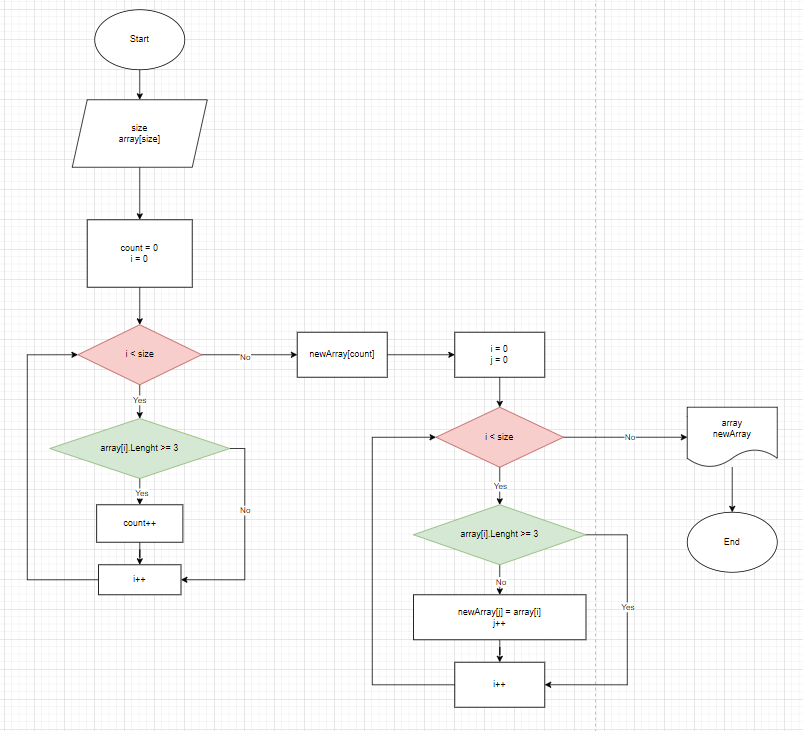

# ЗАДАЧА
## *Написать программу, которая из имеющегося массива строк формирует новый массив из строк, длина которых меньше, либо равна 3 символам.*

## ОПИСАНИЕ РЕШЕНИЯ ЗАДАЧИ

1. `Составление блок-схемы`

Для лучшей визуализации решения задачи необходимо составить блок-схему решения:

2. `Методы решения задачи`

Реализуем решение задачи используя методы (опираемся на блок-схему). Описание методов представлено ниже:
* *InputNum*

Ввод давнных от пользователя (длинна массива) и преобразование их в целочисленное значение.
* *InputItem*

Ввод давнных от пользователя (элементы массива).
* *CreateArray*

Создание первоначального (заданного) массива.
* *FillArray*

Метод заполнения первоначального массива. Для заполнения используем данные пользователя.
* *CreateNewArray*

Метод создания нового (искомого) массива. Считаем, сколько элементов в исходном массиве содержат три и менее символов и создаем массив необходимого размера.
* *FillNewArray*

Заполнение нового (искомого) массива. Заполняем массив элементами, соответствующими заданным параметрам (размер элемента не более трех символов).
* *PrintArray*

Метод печати массивов. Печатаем элементы массивов через запятую.